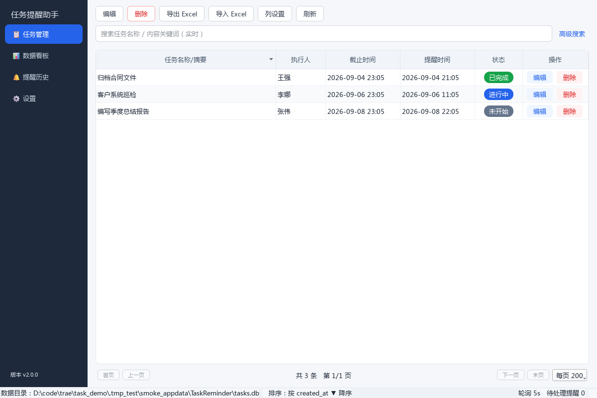

# 任务提醒助手（TaskReminder）

单机版桌面任务提醒软件。Python 3.10 + PyQt6 + SQLite，无需联网，数据全部本地存储。



## 功能特性

- **任务管理**：创建/编辑/删除任务（执行人、富文本内容、截止时间、提醒时间、三态状态），删除二次确认，状态变更记录时间戳
- **任务查看**：表格分页浏览，点击表头排序（▲/▼ 可视化指示），列显隐/列宽/列顺序可配置并持久化
- **高级搜索**：执行人精确匹配、关键词模糊搜索、创建/截止时间范围、状态多选，支持保存常用条件
- **本地提醒**：轮询触发（1-60 秒可配），托盘气泡 + 弹窗（稍后提醒/标记完成）+ 声音（3 种内置音效 + 自定义 wav）
- **提醒历史**：完整记录触发时间、任务快照、用户响应，支持时间范围查询
- **数据看板**：状态统计卡片、分布柱状图、即将提醒/已过期列表
- **Excel 导入导出**：三种导出范围（全部/选中/筛选结果），10 万条 ≤10 秒；导入带校验与冲突处理（跳过/覆盖）
- **备份恢复**：JSON 全量备份（任务 + 历史）与恢复
- **界面**：浅色/深色双主题，字号 11-22px 可调，四页面侧边栏导航，系统托盘常驻
- **大容量**：10 万条任务毫秒级检索（索引 + 分页）

## 快速开始（开发模式）

```powershell
# 1. 创建虚拟环境（Python 3.10+）
python -m venv .venv
.venv\Scripts\python.exe -m pip install -r requirements.txt

# 2. 生成资源（图标 + 提示音）
.venv\Scripts\python.exe scripts\gen_assets.py

# 3. 启动
.venv\Scripts\python.exe run.py
```

## 运行测试

```powershell
.venv\Scripts\python.exe -m pytest -q                 # 全量测试（75 项）
.venv\Scripts\python.exe -m pytest -q --cov=task_reminder --cov-report=term   # 覆盖率（83%）
```

## 打包与安装包

```powershell
powershell -ExecutionPolicy Bypass -File scripts\build_windows.ps1            # onedir + 安装包
powershell -ExecutionPolicy Bypass -File scripts\build_windows.ps1 -Onefile   # 另加便携版单文件
```

产物：

| 文件 | 说明 |
| --- | --- |
| `dist\TaskReminder\TaskReminder.exe` | onedir 主程序 |
| `dist\TaskReminder.exe` | 便携版单文件（onefile） |
| `dist\TaskReminderSetup.exe` | 自包含 GUI 安装器（支持 `/S` 静默安装、`--uninstall` 静默卸载） |

## 性能基准（10 万条任务）

| 操作 | 耗时 |
| --- | --- |
| 分页查询（200 条/页） | 9.5 ms |
| 关键词搜索 | 70.8 ms |
| 排序查询 | 9.9 ms |
| Excel 导出 10 万条 | 7.4 s |

## 数据存储

- 数据库：`%APPDATA%\TaskReminder\tasks.db`（SQLite，含 tasks / reminder_history / user_settings / saved_searches 表）
- 备份：JSON 全量导出/导入；任务数据 Excel 导出/导入

## 目录结构

```
task_reminder/          # 主包
  ui/                   #   界面层（主窗口/任务页/看板/历史/设置/组件/主题）
  db.py repository.py   #   数据层（SQLite schema / 数据访问）
  reminder_service.py   #   提醒轮询服务
  notifier.py sound.py  #   通知与音效
  excel_io.py backup.py #   Excel 导入导出 / JSON 备份
  models.py app_config.py
scripts/                # 构建、基准与工具脚本
tests/                  # pytest 测试（75 项，覆盖率 83%）
docs/                   # 需求文档 / 用户手册（含 PDF）/ 测试报告 / 截图
```

## 文档

- [需求文档](docs/requirements.md)
- [用户操作手册](docs/user_manual.md)（[PDF 版](docs/user_manual.pdf)）
- [测试报告](docs/test_report.md)
