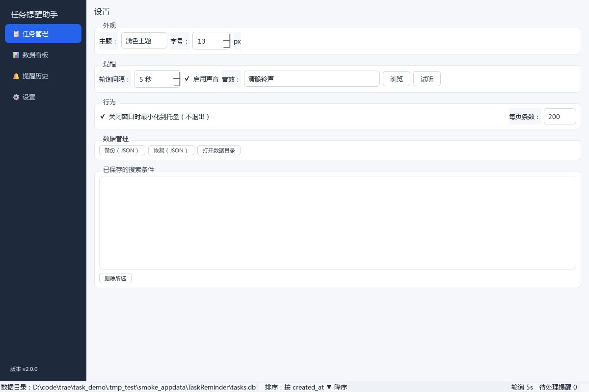
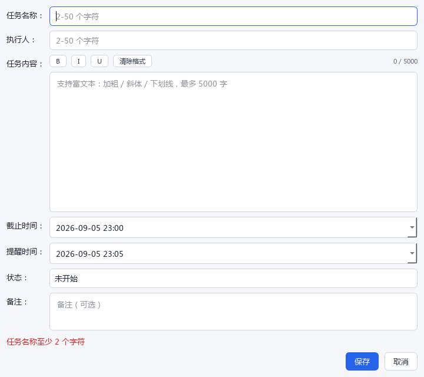
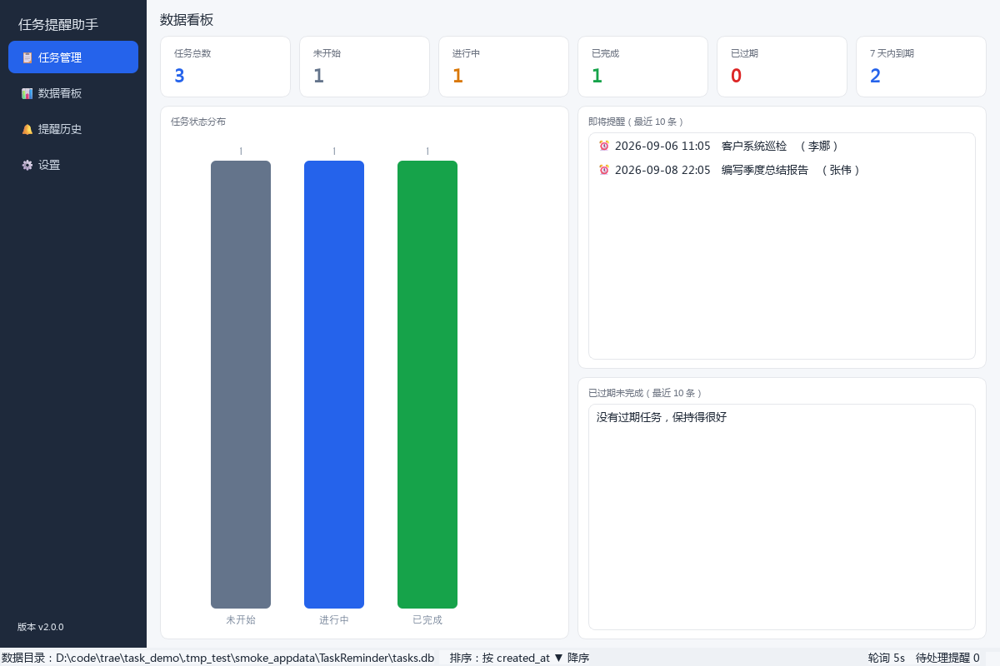
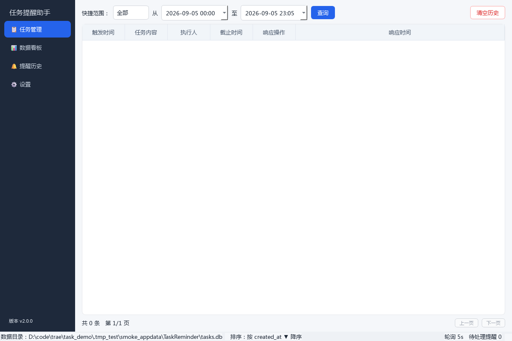
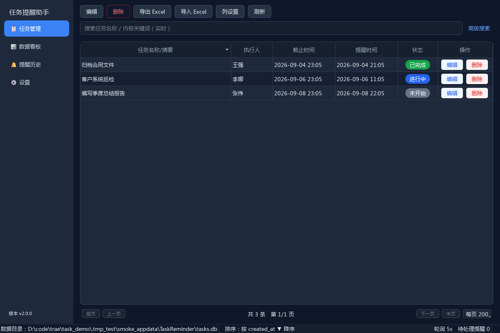

# 任务提醒助手 用户操作手册

**版本 v2.0** ｜ 单机版桌面任务提醒软件 ｜ 支持 Windows 10/11

---

## 目录

1. [产品简介](#1-产品简介)
2. [安装指南](#2-安装指南)
3. [快速上手](#3-快速上手)
4. [功能详解](#4-功能详解)
5. [数据管理](#5-数据管理)
6. [常见问题解答（FAQ）](#6-常见问题解答faq)
7. [技术支持](#7-技术支持)

---

## 1. 产品简介

任务提醒助手是一款**单机版**桌面任务提醒软件，无需联网、数据完全保存在本地。适用于个人与小型团队的日常任务跟踪：登记任务、设定截止时间与提醒时间，到点自动弹窗 + 声音提醒。

### 1.1 核心特性

| 特性 | 说明 |
| --- | --- |
| 任务管理 | 创建/编辑/删除任务，支持富文本描述、执行人、截止时间、提醒时间、三态状态 |
| 多页面界面 | 任务管理、数据看板、提醒历史、设置 四个页面，侧边栏导航 |
| 智能提醒 | 本地轮询定时，弹窗 + 声音（3 种内置音效，可自定义）双通道提醒 |
| 排序可视化 | 点击表头排序，▲/▼ 箭头清晰指示当前排序状态 |
| 高级搜索 | 执行人、关键词、创建/截止时间范围、状态组合筛选，支持保存常用条件 |
| Excel 导入导出 | 支持全部/选中/筛选结果三种范围导出 .xlsx，导入带验证与冲突处理 |
| 数据安全 | SQLite 本地存储 + JSON 备份恢复，崩溃不丢数据 |
| 双主题 | 浅色/深色主题，字号 11-22px 可调，设置即时生效并持久化 |
| 大数据量 | 支持 10 万条任务稳定存储，分页浏览，检索毫秒级 |

### 1.2 运行环境

- Windows 10 / 11（64 位）
- 屏幕分辨率建议 1280×720 以上；最小窗口 800×600
- 无需安装任何运行库，安装包已内置全部依赖

---

## 2. 安装指南

### 2.1 图形化安装（推荐）

1. 双击 `TaskReminderSetup.exe`，进入安装向导。

   

2. 点击「浏览...」选择安装目录（默认 `%LOCALAPPDATA%\Programs\TaskReminder`）。
3. 勾选需要创建的快捷方式（桌面 / 开始菜单）。
4. 点击「安装」，完成后可直接从快捷方式启动。

### 2.2 静默安装（批量部署）

```
TaskReminderSetup.exe /S
```

将按默认配置静默安装，不显示界面。适合 IT 管理员批量分发。

### 2.3 便携版

提供 `TaskReminder.exe` 单文件便携版（onefile），无需安装，双击即用，适合 U 盘携带。注意便携版首次运行同样会在 `%APPDATA%\TaskReminder` 建立数据库。

### 2.4 卸载

- **方式一**：Windows「设置 → 应用 → 安装的应用」中找到「任务提醒助手」点击卸载。
- **方式二**：控制面板「程序和功能」中卸载。
- 卸载不会删除 `%APPDATA%\TaskReminder` 下的数据库与备份文件，重装后数据仍在。

---

## 3. 快速上手

### 3.1 主界面

启动后进入「任务管理」页。左侧为导航栏，右侧为功能区：


- **导航栏**：任务管理 / 数据看板 / 提醒历史 / 设置
- **工具栏**：新建任务、编辑、删除、导出 Excel、导入 Excel、列设置、刷新
- **搜索栏**：实时关键词搜索 + 高级搜索面板
- **任务表格**：任务名称/摘要、执行人、截止时间、提醒时间、状态、备注、操作（编辑/删除内联按钮）
- **分页栏**：首页/上一页/页码/下一页/末页、每页条数（50-500）
- **状态栏**：数据目录、当前排序、轮询间隔、待处理提醒数

### 3.2 创建第一个任务

1. 点击「新建任务」（或右键表格 → 新建任务）。
2. 填写任务信息：

   

   | 字段 | 规则 |
   | --- | --- |
   | 任务名称 | 2-50 个字符 |
   | 执行人 | 2-50 个字符 |
   | 任务内容 | 多行富文本，最长 5000 字符，支持加粗/颜色等格式 |
   | 截止时间 | 日期时间选择器，精确到分钟 |
   | 提醒时间 | 必须早于截止时间，精确到分钟 |
   | 状态 | 未开始 / 进行中 / 已完成 |
   | 备注 | 可选 |

3. 点击「保存」。字段校验不通过时按钮置灰并红字提示。

### 3.3 接收提醒

到达提醒时间时（无论窗口是否在最前）：

- 系统托盘弹出气泡通知，点击可打开主窗口；
- 若任务弹窗出现，可选择「稍后提醒」（5 分钟后再次提醒）或「标记完成」；
- 播放提示音（可在设置中更换或静音）。

---

## 4. 功能详解

### 4.1 任务管理

- **编辑**：双击任务行，或选中后点「编辑」，或点击行内「编辑」按钮。所有字段均可修改，保存时同样做字段验证。
- **删除**：选中行（可多选 Ctrl/Shift）后点「删除」，弹二次确认对话框防止误操作；行内「删除」按钮同样有确认。
- **状态切换**：右键任务 → 「设为」→ 未开始/进行中/已完成。状态变更自动记录时间戳。
- **列设置**：点击「列设置」或右键表头，可显示/隐藏列；表头可拖拽调整列顺序；列宽直接拖拽。所有列配置**自动保存**，下次启动还原。
- **排序**：点击表头在 升序▲ → 降序▼ → 默认 之间循环。支持按截止时间、提醒时间、状态、执行人、任务名称排序。当前排序同时显示在底部状态栏。

### 4.2 搜索与筛选

搜索栏支持实时关键词搜索（任务名称/内容/备注）。点击「高级搜索」展开完整面板：

| 条件 | 匹配方式 |
| --- | --- |
| 执行人 | 精确匹配 |
| 关键词 | 名称/内容/备注模糊匹配 |
| 创建时间范围 | 起止日期时间 |
| 截止时间范围 | 起止日期时间 |
| 状态 | 多选 |

搜索结果实时刷新。可将当前条件**保存**为常用搜索（在设置页管理或删除）。

### 4.3 数据看板



- 顶部统计卡：任务总数、未开始、进行中、已完成、已过期、7 天内到期；
- 任务状态分布柱状图；
- 即将提醒列表（最近 10 条）与已过期未完成列表。

### 4.4 提醒历史



记录每一次已触发的提醒：触发时间、任务内容快照、执行人、截止时间、响应操作（稍后提醒/标记完成）及响应时间。支持快捷范围（今天/近 7 天/近 30 天）与自定义时间范围查询，可一键清空历史。

### 4.5 设置


| 分组 | 配置项 |
| --- | --- |
| 外观 | 主题（浅色/深色）、界面字号（11-22px），即时生效 |



| 分组 | 配置项 |
| --- | --- |
| 提醒 | 轮询间隔（1-60 秒）、启用声音、音效选择（清脆铃声/叮咚提示/紧急警报/自定义 wav）、「试听」 |
| 行为 | 关闭窗口时最小化到托盘、每页条数 |
| 数据管理 | 备份（JSON）、恢复（JSON）、打开数据目录 |
| 搜索管理 | 已保存搜索条件的列表与删除 |

### 4.6 系统托盘

关闭主窗口默认最小化到托盘（可在设置关闭）。托盘图标：双击显示主窗口；右键菜单提供「显示主窗口」「退出」。

---

## 5. 数据管理

### 5.1 存储位置

- 数据库：`%APPDATA%\TaskReminder\tasks.db`（SQLite）
- 该目录同时存放 JSON 备份的建议位置；「打开数据目录」按钮可直达。

### 5.2 Excel 导出

点击「导出 Excel」→ 选择范围：

| 范围 | 内容 |
| --- | --- |
| 全部任务 | 库中所有任务 |
| 选中的任务 | 表格中当前勾选/选中的行 |
| 当前筛选结果 | 命中当前搜索/筛选条件的全部任务 |

导出为 `.xlsx`，包含名称、执行人、内容、截止时间、提醒时间、状态、备注、创建/更新时间等列。10 万条导出实测 ≤10 秒，期间界面不卡顿。

### 5.3 Excel 导入

点击「导入 Excel」→ 选择文件 → 选择重复冲突策略（**跳过**或**覆盖**；重复判定 = 名称+执行人+截止时间均相同）。导入完成后显示成功/跳过/失败统计。导入前程序会校验字段长度与时间合法性，不合规行计入失败而不会污染数据库。

### 5.4 备份与恢复

- **备份**：设置 → 数据管理 → 「备份（JSON）」，导出全部任务 + 提醒历史为单个 JSON 文件。
- **恢复**：「恢复（JSON）」选择备份文件，按 id 增量合并（同 id 覆盖），完成后提示导入数量。

### 5.5 数据安全

- 所有写操作走事务，软件崩溃/断电不会损坏数据库；
- 提醒触发状态每日自动重置，跨天不会漏提醒。

---

## 6. 常见问题解答（FAQ）

**Q1：到点没有提醒？**
确认三点：① 提醒时间早于截止时间且任务未完成；② 软件在运行（最小化到托盘也算）；③ 轮询间隔设置不宜过大（默认 5 秒）。已触发的任务当日不会重复提醒。

**Q2：没有声音？**
设置 → 提醒 → 检查「启用声音」是否勾选；点击「试听」测试。若自定义音效文件被移动/删除，程序回退为系统蜂鸣。

**Q3：换了电脑如何迁移数据？**
旧电脑：设置 → 备份（JSON）。新电脑：安装软件 → 恢复（JSON）。或直接拷贝 `%APPDATA%\TaskReminder\tasks.db`。

**Q4：数据最多能存多少条？**
实测 10 万条任务下分页浏览、搜索、排序均在指标内（首页 <100ms，复杂查询 <1s）。

**Q5：误删了任务能找回吗？**
软件内无回收站。若有之前的 JSON 备份可恢复到备份时点；建议开启定期备份习惯。

**Q6：卸载会丢数据吗？**
不会。卸载只删除程序文件，`%APPDATA%\TaskReminder` 数据保留。

**Q7：支持开机自启动吗？**
当前版本未内置，可将快捷方式放入 `shell:startup` 文件夹实现。

**Q8：导出的 Excel 能改完再导回吗？**
可以。保留表头结构，修改数据后通过「导入 Excel」导回，程序按冲突策略处理。

---

## 7. 技术支持

- 数据目录：`%APPDATA%\TaskReminder`
- 问题反馈请附带：软件版本（状态栏/关于）、数据目录下 `tasks.db` 的备份、复现步骤。

*本手册对应的 PDF 版本可通过文档工具导出（见 `docs/user_manual.md`）。*
